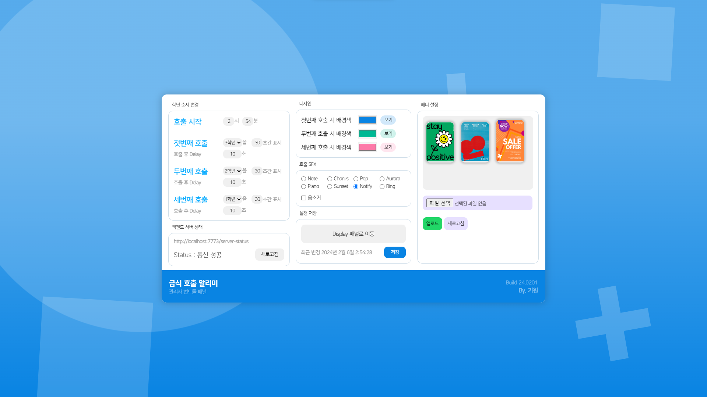

# 🎫 제천제일고 급식 호출 알리미


> 본 프로그램은 제천제일고등학교를 대상으로 작성하였습니다.   
> 타 학교에서 사용하기 위해 일부 소스코드 수정이 필요할 수 있습니다.

## 목차
[💡 미리보기](#💡-미리보기)

[📄 설명](#📄-설명)

[🚀 주요기능](#🚀-주요-기능)

[📘 설치 및 진행](#📘-설치-및-실행)

## 💡 미리보기
- Admin 관리자 패널

- Display 디스플레이 패널 - 순서 호출

- Display 디스플레이 패널 - 유용한 정보


## 📄 설명
특정 시간이 되면 학년을 정해둔 순서대로 호출하는 Web-Applcation입니다.

## 🚀 주요 기능
### 1. 원하는 순서대로 학년 호출
### 2. 급식 정보 표시
### 3. 홍보용 배너 광고 표시
### 4. 날씨 알림
### 5. 다양한 커스텀마이징
### 6. Dynamic Background

## 📘 설치 및 실행
[](https://nodejs.org/en)
[
](https://git-scm.com/)

실행을 위해 최신 버전의 Node.JS와 git이 필요합니다.   
두 프로그램을 설치 후 아래 과정을 따라주세요.

추가로 OpenWeatherMap API키가 필요합니다.   
OpenWeatherMap API키를 발급해주세요.
 
1. 폴더를 Shift+우클릭 후 터미널을 실행합니다.
   
2. Branch 다운로드   
> 터미널에 아래 명령어를 입력합니다.
```shell
git clone https://github.com/whitedev7773/LunchCall2024
```

3. npm 라이브러리 설치
> 아래 스트립트 파일을 실행합니다.
```
1. 라이브러리 설치.bat
```

4. Backend/src/index.js 수정
> 위 경로 파일을 열어서 API_KEY를 발급받은 API키로 바꿔주세요.
> 가능하면 SCHOOL_URL을 학교 급식 링크로 수정해주세요.

5. 백엔드/프론트엔드 서버 실행
> 아래 스트립트 파일을 실행합니다.
```
1. 백엔드 서버 시작.bat
2. 프론트엔드 서버 시작.bat
```

1. 최종 프로그램 실행
> 아래 (1)의 주소로 접속하거나 (2) 파일을 실행합니다.
```
(1) http://localhost:4173
(2) 5. 프로그램 시작.bat
```